# ParaPoly Engine Showcase

[简体中文](README.zh-CN.md) · [npm package](https://www.npmjs.com/package/parapoly-engine)

**3D / CAD models designed with [parapoly-engine](https://www.npmjs.com/package/parapoly-engine).**

Describe an idea, let your AI coding assistant build it with Code3D, then edit the JavaScript and export a real model. This collection spans everyday objects, furniture, mechanical parts and detailed assemblies. Every example includes a single model source file, previews, and downloadable **GLB**, **STEP** and **BMAX** files.

## Explore the models

21 examples. Each row compares one model in four columns: CAD, BMAX 64, BMAX 32 and BMAX 16. All previews support light/dark themes. BMAX resolution is the longest edge in voxels; voxel size uses the model's source units. Click a thumbnail for downloads, source code and design notes. Multi-view images and reusable design skills are included where available.

<table>
  <tr>
    <td width="25%" valign="top" align="center"><a href="examples/1-boolean-cutout/README.md"><picture><source media="(prefers-color-scheme: dark)" srcset="examples/1-boolean-cutout/preview.png">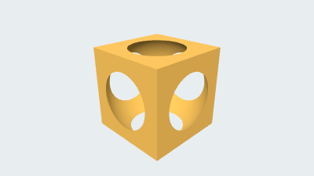</picture><br><strong>1. Boolean cutout</strong></a><br>CAD<br><a href="https://github.com/parapoly-engine/parapoly-engine-showcase/releases/download/models-2026-09-22/1-boolean-cutout.glb">GLB</a> · <a href="https://github.com/parapoly-engine/parapoly-engine-showcase/releases/download/models-2026-09-22/1-boolean-cutout.step">STEP</a> · <a href="examples/1-boolean-cutout/main.code3d.js">Code</a></td>
    <td width="25%" valign="top" align="center"><a href="examples/1-boolean-cutout/README.md"><picture><source media="(prefers-color-scheme: dark)" srcset="examples/1-boolean-cutout/bmax/64/preview.png">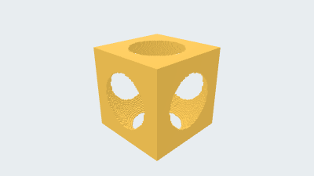</picture></a><br><strong>BMAX 64</strong><br>Longest edge 64 voxels<br>Voxel size ≈ 0.015625<br><a href="https://github.com/parapoly-engine/parapoly-engine-showcase/releases/download/models-2026-09-22/1-boolean-cutout-bmax-64.bmax">Download BMAX 64</a></td>
    <td width="25%" valign="top" align="center"><a href="examples/1-boolean-cutout/README.md"><picture><source media="(prefers-color-scheme: dark)" srcset="examples/1-boolean-cutout/bmax/32/preview.png">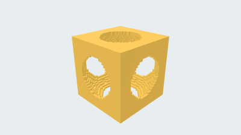</picture></a><br><strong>BMAX 32</strong><br>Longest edge 32 voxels<br>Voxel size ≈ 0.03125<br><a href="https://github.com/parapoly-engine/parapoly-engine-showcase/releases/download/models-2026-09-22/1-boolean-cutout-bmax-32.bmax">Download BMAX 32</a></td>
    <td width="25%" valign="top" align="center"><a href="examples/1-boolean-cutout/README.md"><picture><source media="(prefers-color-scheme: dark)" srcset="examples/1-boolean-cutout/bmax/16/preview.png">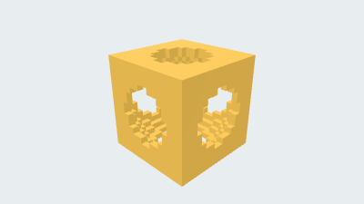</picture></a><br><strong>BMAX 16</strong><br>Longest edge 16 voxels<br>Voxel size ≈ 0.0625<br><a href="https://github.com/parapoly-engine/parapoly-engine-showcase/releases/download/models-2026-09-22/1-boolean-cutout-bmax-16.bmax">Download BMAX 16</a></td>
  </tr>
  <tr>
    <td width="25%" valign="top" align="center"><a href="examples/2-woven-basket-block3d/README.md"><picture><source media="(prefers-color-scheme: dark)" srcset="examples/2-woven-basket-block3d/preview.png"></picture><br><strong>2. Woven basket</strong></a><br>CAD<br><a href="https://github.com/parapoly-engine/parapoly-engine-showcase/releases/download/models-2026-09-22/2-woven-basket-block3d.glb">GLB</a> · <a href="https://github.com/parapoly-engine/parapoly-engine-showcase/releases/download/models-2026-09-22/2-woven-basket-block3d.step">STEP</a> · <a href="examples/2-woven-basket-block3d/main.code3d.js">Code</a></td>
    <td width="25%" valign="top" align="center"><a href="examples/2-woven-basket-block3d/README.md"><picture><source media="(prefers-color-scheme: dark)" srcset="examples/2-woven-basket-block3d/bmax/64/preview.png">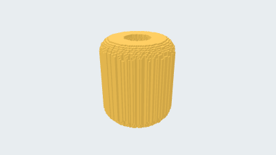</picture></a><br><strong>BMAX 64</strong><br>Longest edge 64 voxels<br>Voxel size ≈ 0.1875<br><a href="https://github.com/parapoly-engine/parapoly-engine-showcase/releases/download/models-2026-09-22/2-woven-basket-block3d-bmax-64.bmax">Download BMAX 64</a></td>
    <td width="25%" valign="top" align="center"><a href="examples/2-woven-basket-block3d/README.md"><picture><source media="(prefers-color-scheme: dark)" srcset="examples/2-woven-basket-block3d/bmax/32/preview.png">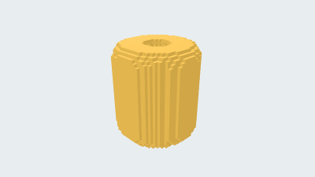</picture></a><br><strong>BMAX 32</strong><br>Longest edge 32 voxels<br>Voxel size ≈ 0.375<br><a href="https://github.com/parapoly-engine/parapoly-engine-showcase/releases/download/models-2026-09-22/2-woven-basket-block3d-bmax-32.bmax">Download BMAX 32</a></td>
    <td width="25%" valign="top" align="center"><a href="examples/2-woven-basket-block3d/README.md"><picture><source media="(prefers-color-scheme: dark)" srcset="examples/2-woven-basket-block3d/bmax/16/preview.png">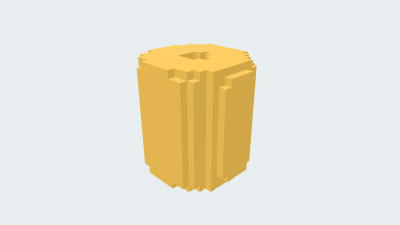</picture></a><br><strong>BMAX 16</strong><br>Longest edge 16 voxels<br>Voxel size ≈ 0.75<br><a href="https://github.com/parapoly-engine/parapoly-engine-showcase/releases/download/models-2026-09-22/2-woven-basket-block3d-bmax-16.bmax">Download BMAX 16</a></td>
  </tr>
  <tr>
    <td width="25%" valign="top" align="center"><a href="examples/3-billiards-single-file/README.md"><picture><source media="(prefers-color-scheme: dark)" srcset="examples/3-billiards-single-file/preview.png">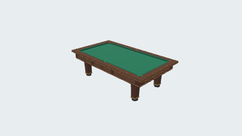</picture><br><strong>3. Billiards table</strong></a><br>CAD<br><a href="https://github.com/parapoly-engine/parapoly-engine-showcase/releases/download/models-2026-09-22/3-billiards-single-file.glb">GLB</a> · <a href="https://github.com/parapoly-engine/parapoly-engine-showcase/releases/download/models-2026-09-22/3-billiards-single-file.step">STEP</a> · <a href="examples/3-billiards-single-file/main.code3d.js">Code</a></td>
    <td width="25%" valign="top" align="center"><a href="examples/3-billiards-single-file/README.md"><picture><source media="(prefers-color-scheme: dark)" srcset="examples/3-billiards-single-file/bmax/64/preview.png">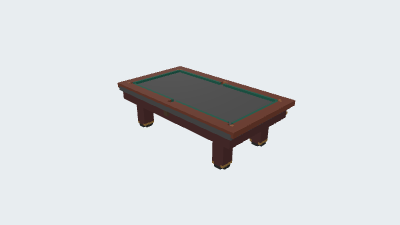</picture></a><br><strong>BMAX 64</strong><br>Longest edge 64 voxels<br>Voxel size ≈ 44.4375<br><a href="https://github.com/parapoly-engine/parapoly-engine-showcase/releases/download/models-2026-09-22/3-billiards-single-file-bmax-64.bmax">Download BMAX 64</a></td>
    <td width="25%" valign="top" align="center"><a href="examples/3-billiards-single-file/README.md"><picture><source media="(prefers-color-scheme: dark)" srcset="examples/3-billiards-single-file/bmax/32/preview.png">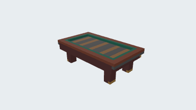</picture></a><br><strong>BMAX 32</strong><br>Longest edge 32 voxels<br>Voxel size ≈ 88.875<br><a href="https://github.com/parapoly-engine/parapoly-engine-showcase/releases/download/models-2026-09-22/3-billiards-single-file-bmax-32.bmax">Download BMAX 32</a></td>
    <td width="25%" valign="top" align="center"><a href="examples/3-billiards-single-file/README.md"><picture><source media="(prefers-color-scheme: dark)" srcset="examples/3-billiards-single-file/bmax/16/preview.png">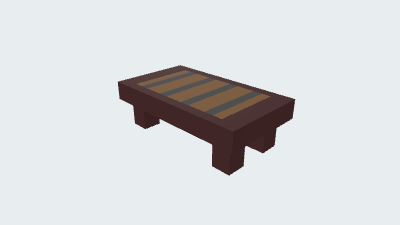</picture></a><br><strong>BMAX 16</strong><br>Longest edge 16 voxels<br>Voxel size ≈ 177.75<br><a href="https://github.com/parapoly-engine/parapoly-engine-showcase/releases/download/models-2026-09-22/3-billiards-single-file-bmax-16.bmax">Download BMAX 16</a></td>
  </tr>
  <tr>
    <td width="25%" valign="top" align="center"><a href="examples/4-coffee-cup-block3d/README.md"><picture><source media="(prefers-color-scheme: dark)" srcset="examples/4-coffee-cup-block3d/preview.png">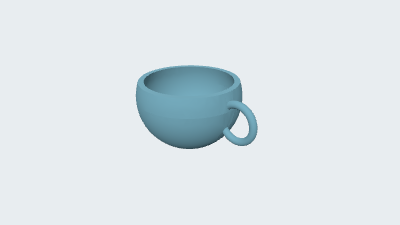</picture><br><strong>4. Coffee cup</strong></a><br>CAD<br><a href="https://github.com/parapoly-engine/parapoly-engine-showcase/releases/download/models-2026-09-22/4-coffee-cup-block3d.glb">GLB</a> · <a href="https://github.com/parapoly-engine/parapoly-engine-showcase/releases/download/models-2026-09-22/4-coffee-cup-block3d.step">STEP</a> · <a href="examples/4-coffee-cup-block3d/main.code3d.js">Code</a></td>
    <td width="25%" valign="top" align="center"><a href="examples/4-coffee-cup-block3d/README.md"><picture><source media="(prefers-color-scheme: dark)" srcset="examples/4-coffee-cup-block3d/bmax/64/preview.png">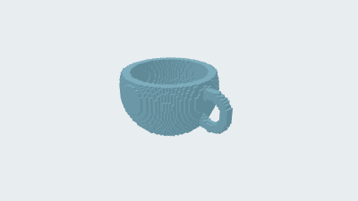</picture></a><br><strong>BMAX 64</strong><br>Longest edge 64 voxels<br>Voxel size ≈ 0.120226<br><a href="https://github.com/parapoly-engine/parapoly-engine-showcase/releases/download/models-2026-09-22/4-coffee-cup-block3d-bmax-64.bmax">Download BMAX 64</a></td>
    <td width="25%" valign="top" align="center"><a href="examples/4-coffee-cup-block3d/README.md"><picture><source media="(prefers-color-scheme: dark)" srcset="examples/4-coffee-cup-block3d/bmax/32/preview.png">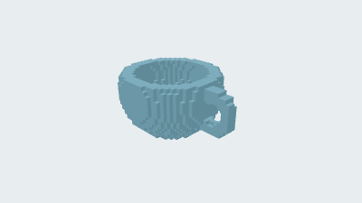</picture></a><br><strong>BMAX 32</strong><br>Longest edge 32 voxels<br>Voxel size ≈ 0.240453<br><a href="https://github.com/parapoly-engine/parapoly-engine-showcase/releases/download/models-2026-09-22/4-coffee-cup-block3d-bmax-32.bmax">Download BMAX 32</a></td>
    <td width="25%" valign="top" align="center"><a href="examples/4-coffee-cup-block3d/README.md"><picture><source media="(prefers-color-scheme: dark)" srcset="examples/4-coffee-cup-block3d/bmax/16/preview.png">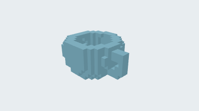</picture></a><br><strong>BMAX 16</strong><br>Longest edge 16 voxels<br>Voxel size ≈ 0.480906<br><a href="https://github.com/parapoly-engine/parapoly-engine-showcase/releases/download/models-2026-09-22/4-coffee-cup-block3d-bmax-16.bmax">Download BMAX 16</a></td>
  </tr>
  <tr>
    <td width="25%" valign="top" align="center"><a href="examples/5-round-bottom-wok/README.md"><picture><source media="(prefers-color-scheme: dark)" srcset="examples/5-round-bottom-wok/preview.png">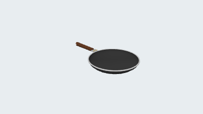</picture><br><strong>5. Round-bottom wok</strong></a><br>CAD<br><a href="https://github.com/parapoly-engine/parapoly-engine-showcase/releases/download/models-2026-09-22/5-round-bottom-wok.glb">GLB</a> · <a href="https://github.com/parapoly-engine/parapoly-engine-showcase/releases/download/models-2026-09-22/5-round-bottom-wok.step">STEP</a> · <a href="examples/5-round-bottom-wok/main.code3d.js">Code</a></td>
    <td width="25%" valign="top" align="center"><a href="examples/5-round-bottom-wok/README.md"><picture><source media="(prefers-color-scheme: dark)" srcset="examples/5-round-bottom-wok/bmax/64/preview.png"></picture></a><br><strong>BMAX 64</strong><br>Longest edge 64 voxels<br>Voxel size ≈ 0.692182<br><a href="https://github.com/parapoly-engine/parapoly-engine-showcase/releases/download/models-2026-09-22/5-round-bottom-wok-bmax-64.bmax">Download BMAX 64</a></td>
    <td width="25%" valign="top" align="center"><a href="examples/5-round-bottom-wok/README.md"><picture><source media="(prefers-color-scheme: dark)" srcset="examples/5-round-bottom-wok/bmax/32/preview.png">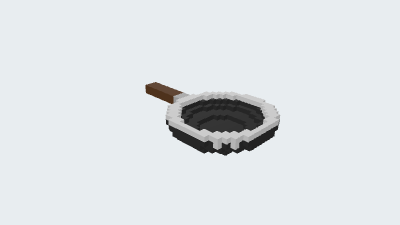</picture></a><br><strong>BMAX 32</strong><br>Longest edge 32 voxels<br>Voxel size ≈ 1.38436<br><a href="https://github.com/parapoly-engine/parapoly-engine-showcase/releases/download/models-2026-09-22/5-round-bottom-wok-bmax-32.bmax">Download BMAX 32</a></td>
    <td width="25%" valign="top" align="center"><a href="examples/5-round-bottom-wok/README.md"><picture><source media="(prefers-color-scheme: dark)" srcset="examples/5-round-bottom-wok/bmax/16/preview.png">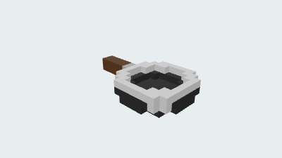</picture></a><br><strong>BMAX 16</strong><br>Longest edge 16 voxels<br>Voxel size ≈ 2.76873<br><a href="https://github.com/parapoly-engine/parapoly-engine-showcase/releases/download/models-2026-09-22/5-round-bottom-wok-bmax-16.bmax">Download BMAX 16</a></td>
  </tr>
  <tr>
    <td width="25%" valign="top" align="center"><a href="examples/6-cast-iron-skillet/README.md"><picture><source media="(prefers-color-scheme: dark)" srcset="examples/6-cast-iron-skillet/preview.png">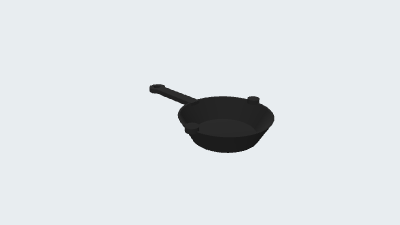</picture><br><strong>6. Cast-iron skillet</strong></a><br>CAD<br><a href="https://github.com/parapoly-engine/parapoly-engine-showcase/releases/download/models-2026-09-22/6-cast-iron-skillet.glb">GLB</a> · <a href="https://github.com/parapoly-engine/parapoly-engine-showcase/releases/download/models-2026-09-22/6-cast-iron-skillet.step">STEP</a> · <a href="examples/6-cast-iron-skillet/main.code3d.js">Code</a></td>
    <td width="25%" valign="top" align="center"><a href="examples/6-cast-iron-skillet/README.md"><picture><source media="(prefers-color-scheme: dark)" srcset="examples/6-cast-iron-skillet/bmax/64/preview.png">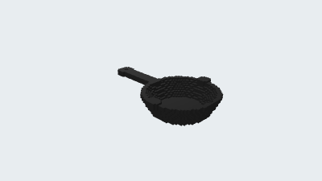</picture></a><br><strong>BMAX 64</strong><br>Longest edge 64 voxels<br>Voxel size ≈ 0.604672<br><a href="https://github.com/parapoly-engine/parapoly-engine-showcase/releases/download/models-2026-09-22/6-cast-iron-skillet-bmax-64.bmax">Download BMAX 64</a></td>
    <td width="25%" valign="top" align="center"><a href="examples/6-cast-iron-skillet/README.md"><picture><source media="(prefers-color-scheme: dark)" srcset="examples/6-cast-iron-skillet/bmax/32/preview.png">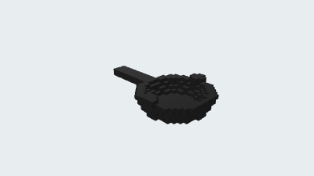</picture></a><br><strong>BMAX 32</strong><br>Longest edge 32 voxels<br>Voxel size ≈ 1.20934<br><a href="https://github.com/parapoly-engine/parapoly-engine-showcase/releases/download/models-2026-09-22/6-cast-iron-skillet-bmax-32.bmax">Download BMAX 32</a></td>
    <td width="25%" valign="top" align="center"><a href="examples/6-cast-iron-skillet/README.md"><picture><source media="(prefers-color-scheme: dark)" srcset="examples/6-cast-iron-skillet/bmax/16/preview.png">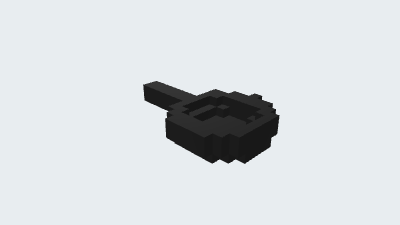</picture></a><br><strong>BMAX 16</strong><br>Longest edge 16 voxels<br>Voxel size ≈ 2.41869<br><a href="https://github.com/parapoly-engine/parapoly-engine-showcase/releases/download/models-2026-09-22/6-cast-iron-skillet-bmax-16.bmax">Download BMAX 16</a></td>
  </tr>
  <tr>
    <td width="25%" valign="top" align="center"><a href="examples/7-lunar-rover-block3d/README.md"><picture><source media="(prefers-color-scheme: dark)" srcset="examples/7-lunar-rover-block3d/preview.png"></picture><br><strong>7. Lunar rover</strong></a><br>CAD<br><a href="https://github.com/parapoly-engine/parapoly-engine-showcase/releases/download/models-2026-09-22/7-lunar-rover-block3d.glb">GLB</a> · <a href="https://github.com/parapoly-engine/parapoly-engine-showcase/releases/download/models-2026-09-22/7-lunar-rover-block3d.step">STEP</a> · <a href="examples/7-lunar-rover-block3d/main.code3d.js">Code</a></td>
    <td width="25%" valign="top" align="center"><a href="examples/7-lunar-rover-block3d/README.md"><picture><source media="(prefers-color-scheme: dark)" srcset="examples/7-lunar-rover-block3d/bmax/64/preview.png"></picture></a><br><strong>BMAX 64</strong><br>Longest edge 64 voxels<br>Voxel size ≈ 0.123005<br><a href="https://github.com/parapoly-engine/parapoly-engine-showcase/releases/download/models-2026-09-22/7-lunar-rover-block3d-bmax-64.bmax">Download BMAX 64</a></td>
    <td width="25%" valign="top" align="center"><a href="examples/7-lunar-rover-block3d/README.md"><picture><source media="(prefers-color-scheme: dark)" srcset="examples/7-lunar-rover-block3d/bmax/32/preview.png"></picture></a><br><strong>BMAX 32</strong><br>Longest edge 32 voxels<br>Voxel size ≈ 0.246009<br><a href="https://github.com/parapoly-engine/parapoly-engine-showcase/releases/download/models-2026-09-22/7-lunar-rover-block3d-bmax-32.bmax">Download BMAX 32</a></td>
    <td width="25%" valign="top" align="center"><a href="examples/7-lunar-rover-block3d/README.md"><picture><source media="(prefers-color-scheme: dark)" srcset="examples/7-lunar-rover-block3d/bmax/16/preview.png"></picture></a><br><strong>BMAX 16</strong><br>Longest edge 16 voxels<br>Voxel size ≈ 0.492018<br><a href="https://github.com/parapoly-engine/parapoly-engine-showcase/releases/download/models-2026-09-22/7-lunar-rover-block3d-bmax-16.bmax">Download BMAX 16</a></td>
  </tr>
  <tr>
    <td width="25%" valign="top" align="center"><a href="examples/8-microscope-block3d/README.md"><picture><source media="(prefers-color-scheme: dark)" srcset="examples/8-microscope-block3d/preview.png">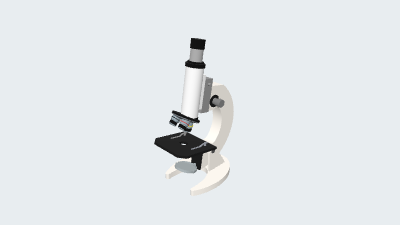</picture><br><strong>8. Microscope</strong></a><br>CAD<br><a href="https://github.com/parapoly-engine/parapoly-engine-showcase/releases/download/models-2026-09-22/8-microscope-block3d.glb">GLB</a> · <a href="https://github.com/parapoly-engine/parapoly-engine-showcase/releases/download/models-2026-09-22/8-microscope-block3d.step">STEP</a> · <a href="examples/8-microscope-block3d/main.code3d.js">Code</a></td>
    <td width="25%" valign="top" align="center"><a href="examples/8-microscope-block3d/README.md"><picture><source media="(prefers-color-scheme: dark)" srcset="examples/8-microscope-block3d/bmax/64/preview.png">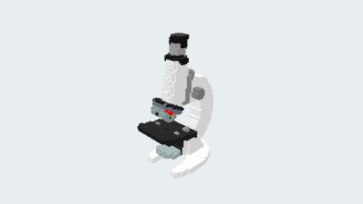</picture></a><br><strong>BMAX 64</strong><br>Longest edge 64 voxels<br>Voxel size ≈ 5.48351<br><a href="https://github.com/parapoly-engine/parapoly-engine-showcase/releases/download/models-2026-09-22/8-microscope-block3d-bmax-64.bmax">Download BMAX 64</a></td>
    <td width="25%" valign="top" align="center"><a href="examples/8-microscope-block3d/README.md"><picture><source media="(prefers-color-scheme: dark)" srcset="examples/8-microscope-block3d/bmax/32/preview.png">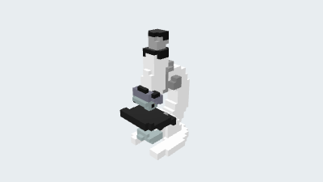</picture></a><br><strong>BMAX 32</strong><br>Longest edge 32 voxels<br>Voxel size ≈ 10.967<br><a href="https://github.com/parapoly-engine/parapoly-engine-showcase/releases/download/models-2026-09-22/8-microscope-block3d-bmax-32.bmax">Download BMAX 32</a></td>
    <td width="25%" valign="top" align="center"><a href="examples/8-microscope-block3d/README.md"><picture><source media="(prefers-color-scheme: dark)" srcset="examples/8-microscope-block3d/bmax/16/preview.png">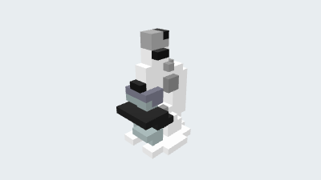</picture></a><br><strong>BMAX 16</strong><br>Longest edge 16 voxels<br>Voxel size ≈ 21.934<br><a href="https://github.com/parapoly-engine/parapoly-engine-showcase/releases/download/models-2026-09-22/8-microscope-block3d-bmax-16.bmax">Download BMAX 16</a></td>
  </tr>
  <tr>
    <td width="25%" valign="top" align="center"><a href="examples/9-mario-kart-single-file/README.md"><picture><source media="(prefers-color-scheme: dark)" srcset="examples/9-mario-kart-single-file/preview.png">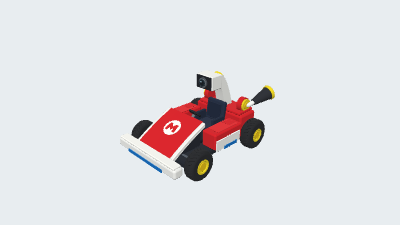</picture><br><strong>9. Racing kart</strong></a><br>CAD<br><a href="https://github.com/parapoly-engine/parapoly-engine-showcase/releases/download/models-2026-09-22/9-mario-kart-single-file.glb">GLB</a> · <a href="https://github.com/parapoly-engine/parapoly-engine-showcase/releases/download/models-2026-09-22/9-mario-kart-single-file.step">STEP</a> · <a href="examples/9-mario-kart-single-file/main.code3d.js">Code</a></td>
    <td width="25%" valign="top" align="center"><a href="examples/9-mario-kart-single-file/README.md"><picture><source media="(prefers-color-scheme: dark)" srcset="examples/9-mario-kart-single-file/bmax/64/preview.png">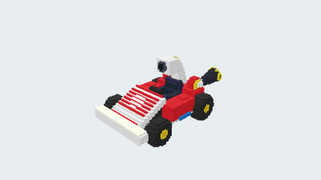</picture></a><br><strong>BMAX 64</strong><br>Longest edge 64 voxels<br>Voxel size ≈ 3.57995<br><a href="https://github.com/parapoly-engine/parapoly-engine-showcase/releases/download/models-2026-09-22/9-mario-kart-single-file-bmax-64.bmax">Download BMAX 64</a></td>
    <td width="25%" valign="top" align="center"><a href="examples/9-mario-kart-single-file/README.md"><picture><source media="(prefers-color-scheme: dark)" srcset="examples/9-mario-kart-single-file/bmax/32/preview.png">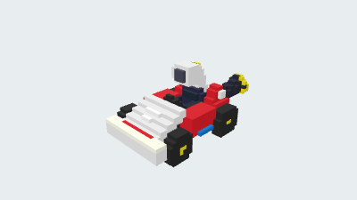</picture></a><br><strong>BMAX 32</strong><br>Longest edge 32 voxels<br>Voxel size ≈ 7.1599<br><a href="https://github.com/parapoly-engine/parapoly-engine-showcase/releases/download/models-2026-09-22/9-mario-kart-single-file-bmax-32.bmax">Download BMAX 32</a></td>
    <td width="25%" valign="top" align="center"><a href="examples/9-mario-kart-single-file/README.md"><picture><source media="(prefers-color-scheme: dark)" srcset="examples/9-mario-kart-single-file/bmax/16/preview.png">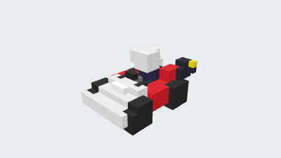</picture></a><br><strong>BMAX 16</strong><br>Longest edge 16 voxels<br>Voxel size ≈ 14.3198<br><a href="https://github.com/parapoly-engine/parapoly-engine-showcase/releases/download/models-2026-09-22/9-mario-kart-single-file-bmax-16.bmax">Download BMAX 16</a></td>
  </tr>
  <tr>
    <td width="25%" valign="top" align="center"><a href="examples/10-woven-bamboo-chair/README.md"><picture><source media="(prefers-color-scheme: dark)" srcset="examples/10-woven-bamboo-chair/preview.png">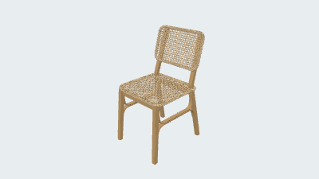</picture><br><strong>10. Woven bamboo chair</strong></a><br>CAD<br><a href="https://github.com/parapoly-engine/parapoly-engine-showcase/releases/download/models-2026-09-22/10-woven-bamboo-chair.glb">GLB</a> · <a href="https://github.com/parapoly-engine/parapoly-engine-showcase/releases/download/models-2026-09-22/10-woven-bamboo-chair.step">STEP</a> · <a href="examples/10-woven-bamboo-chair/main.code3d.js">Code</a></td>
    <td width="25%" valign="top" align="center"><a href="examples/10-woven-bamboo-chair/README.md"><picture><source media="(prefers-color-scheme: dark)" srcset="examples/10-woven-bamboo-chair/bmax/64/preview.png">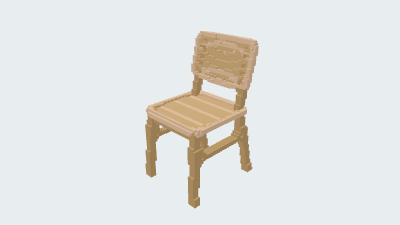</picture></a><br><strong>BMAX 64</strong><br>Longest edge 64 voxels<br>Voxel size ≈ 13.2814<br><a href="https://github.com/parapoly-engine/parapoly-engine-showcase/releases/download/models-2026-09-22/10-woven-bamboo-chair-bmax-64.bmax">Download BMAX 64</a></td>
    <td width="25%" valign="top" align="center"><a href="examples/10-woven-bamboo-chair/README.md"><picture><source media="(prefers-color-scheme: dark)" srcset="examples/10-woven-bamboo-chair/bmax/32/preview.png">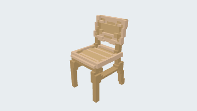</picture></a><br><strong>BMAX 32</strong><br>Longest edge 32 voxels<br>Voxel size ≈ 26.5627<br><a href="https://github.com/parapoly-engine/parapoly-engine-showcase/releases/download/models-2026-09-22/10-woven-bamboo-chair-bmax-32.bmax">Download BMAX 32</a></td>
    <td width="25%" valign="top" align="center"><a href="examples/10-woven-bamboo-chair/README.md"><picture><source media="(prefers-color-scheme: dark)" srcset="examples/10-woven-bamboo-chair/bmax/16/preview.png">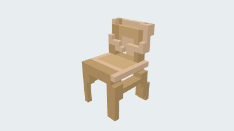</picture></a><br><strong>BMAX 16</strong><br>Longest edge 16 voxels<br>Voxel size ≈ 53.1255<br><a href="https://github.com/parapoly-engine/parapoly-engine-showcase/releases/download/models-2026-09-22/10-woven-bamboo-chair-bmax-16.bmax">Download BMAX 16</a></td>
  </tr>
  <tr>
    <td width="25%" valign="top" align="center"><a href="examples/11-spindle-back-chair/README.md"><picture><source media="(prefers-color-scheme: dark)" srcset="examples/11-spindle-back-chair/preview.png">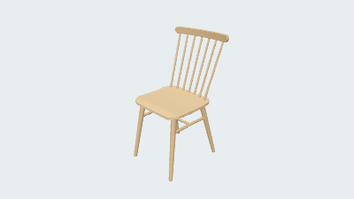</picture><br><strong>11. Spindle-back chair</strong></a><br>CAD<br><a href="https://github.com/parapoly-engine/parapoly-engine-showcase/releases/download/models-2026-09-22/11-spindle-back-chair.glb">GLB</a> · <a href="https://github.com/parapoly-engine/parapoly-engine-showcase/releases/download/models-2026-09-22/11-spindle-back-chair.step">STEP</a> · <a href="examples/11-spindle-back-chair/main.code3d.js">Code</a></td>
    <td width="25%" valign="top" align="center"><a href="examples/11-spindle-back-chair/README.md"><picture><source media="(prefers-color-scheme: dark)" srcset="examples/11-spindle-back-chair/bmax/64/preview.png">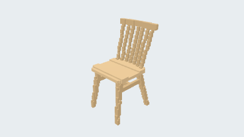</picture></a><br><strong>BMAX 64</strong><br>Longest edge 64 voxels<br>Voxel size ≈ 13.4375<br><a href="https://github.com/parapoly-engine/parapoly-engine-showcase/releases/download/models-2026-09-22/11-spindle-back-chair-bmax-64.bmax">Download BMAX 64</a></td>
    <td width="25%" valign="top" align="center"><a href="examples/11-spindle-back-chair/README.md"><picture><source media="(prefers-color-scheme: dark)" srcset="examples/11-spindle-back-chair/bmax/32/preview.png">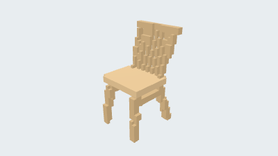</picture></a><br><strong>BMAX 32</strong><br>Longest edge 32 voxels<br>Voxel size ≈ 26.875<br><a href="https://github.com/parapoly-engine/parapoly-engine-showcase/releases/download/models-2026-09-22/11-spindle-back-chair-bmax-32.bmax">Download BMAX 32</a></td>
    <td width="25%" valign="top" align="center"><a href="examples/11-spindle-back-chair/README.md"><picture><source media="(prefers-color-scheme: dark)" srcset="examples/11-spindle-back-chair/bmax/16/preview.png">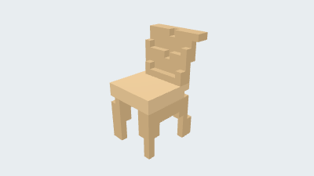</picture></a><br><strong>BMAX 16</strong><br>Longest edge 16 voxels<br>Voxel size ≈ 53.75<br><a href="https://github.com/parapoly-engine/parapoly-engine-showcase/releases/download/models-2026-09-22/11-spindle-back-chair-bmax-16.bmax">Download BMAX 16</a></td>
  </tr>
  <tr>
    <td width="25%" valign="top" align="center"><a href="examples/12-part3d-roundtrip/README.md"><picture><source media="(prefers-color-scheme: dark)" srcset="examples/12-part3d-roundtrip/preview.png">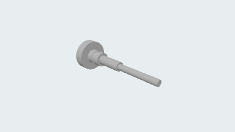</picture><br><strong>12. Dipstick</strong></a><br>CAD<br><a href="https://github.com/parapoly-engine/parapoly-engine-showcase/releases/download/models-2026-09-22/12-part3d-roundtrip.glb">GLB</a> · <a href="https://github.com/parapoly-engine/parapoly-engine-showcase/releases/download/models-2026-09-22/12-part3d-roundtrip.step">STEP</a> · <a href="examples/12-part3d-roundtrip/main.code3d.js">Code</a></td>
    <td width="25%" valign="top" align="center"><a href="examples/12-part3d-roundtrip/README.md"><picture><source media="(prefers-color-scheme: dark)" srcset="examples/12-part3d-roundtrip/bmax/64/preview.png"></picture></a><br><strong>BMAX 64</strong><br>Longest edge 64 voxels<br>Voxel size ≈ 2.34375<br><a href="https://github.com/parapoly-engine/parapoly-engine-showcase/releases/download/models-2026-09-22/12-part3d-roundtrip-bmax-64.bmax">Download BMAX 64</a></td>
    <td width="25%" valign="top" align="center"><a href="examples/12-part3d-roundtrip/README.md"><picture><source media="(prefers-color-scheme: dark)" srcset="examples/12-part3d-roundtrip/bmax/32/preview.png">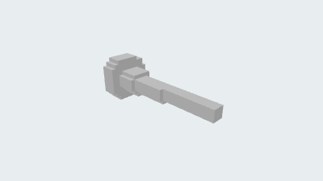</picture></a><br><strong>BMAX 32</strong><br>Longest edge 32 voxels<br>Voxel size ≈ 4.6875<br><a href="https://github.com/parapoly-engine/parapoly-engine-showcase/releases/download/models-2026-09-22/12-part3d-roundtrip-bmax-32.bmax">Download BMAX 32</a></td>
    <td width="25%" valign="top" align="center"><a href="examples/12-part3d-roundtrip/README.md"><picture><source media="(prefers-color-scheme: dark)" srcset="examples/12-part3d-roundtrip/bmax/16/preview.png">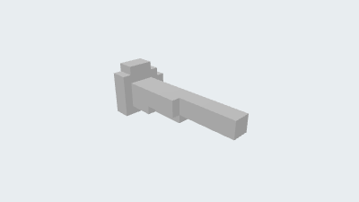</picture></a><br><strong>BMAX 16</strong><br>Longest edge 16 voxels<br>Voxel size ≈ 9.375<br><a href="https://github.com/parapoly-engine/parapoly-engine-showcase/releases/download/models-2026-09-22/12-part3d-roundtrip-bmax-16.bmax">Download BMAX 16</a></td>
  </tr>
  <tr>
    <td width="25%" valign="top" align="center"><a href="examples/13-stepped-flange/README.md"><picture><source media="(prefers-color-scheme: dark)" srcset="examples/13-stepped-flange/preview.png">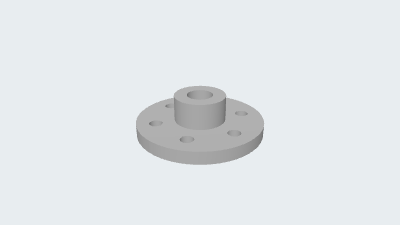</picture><br><strong>13. Stepped flange</strong></a><br>CAD<br><a href="https://github.com/parapoly-engine/parapoly-engine-showcase/releases/download/models-2026-09-22/13-stepped-flange.glb">GLB</a> · <a href="https://github.com/parapoly-engine/parapoly-engine-showcase/releases/download/models-2026-09-22/13-stepped-flange.step">STEP</a> · <a href="examples/13-stepped-flange/main.code3d.js">Code</a></td>
    <td width="25%" valign="top" align="center"><a href="examples/13-stepped-flange/README.md"><picture><source media="(prefers-color-scheme: dark)" srcset="examples/13-stepped-flange/bmax/64/preview.png">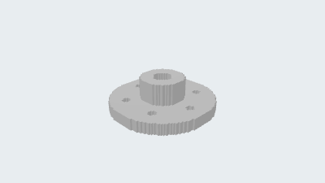</picture></a><br><strong>BMAX 64</strong><br>Longest edge 64 voxels<br>Voxel size ≈ 1.5625<br><a href="https://github.com/parapoly-engine/parapoly-engine-showcase/releases/download/models-2026-09-22/13-stepped-flange-bmax-64.bmax">Download BMAX 64</a></td>
    <td width="25%" valign="top" align="center"><a href="examples/13-stepped-flange/README.md"><picture><source media="(prefers-color-scheme: dark)" srcset="examples/13-stepped-flange/bmax/32/preview.png">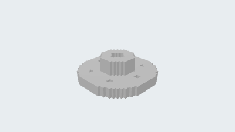</picture></a><br><strong>BMAX 32</strong><br>Longest edge 32 voxels<br>Voxel size ≈ 3.125<br><a href="https://github.com/parapoly-engine/parapoly-engine-showcase/releases/download/models-2026-09-22/13-stepped-flange-bmax-32.bmax">Download BMAX 32</a></td>
    <td width="25%" valign="top" align="center"><a href="examples/13-stepped-flange/README.md"><picture><source media="(prefers-color-scheme: dark)" srcset="examples/13-stepped-flange/bmax/16/preview.png">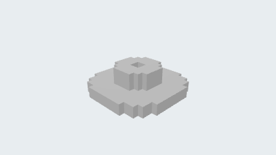</picture></a><br><strong>BMAX 16</strong><br>Longest edge 16 voxels<br>Voxel size ≈ 6.25<br><a href="https://github.com/parapoly-engine/parapoly-engine-showcase/releases/download/models-2026-09-22/13-stepped-flange-bmax-16.bmax">Download BMAX 16</a></td>
  </tr>
  <tr>
    <td width="25%" valign="top" align="center"><a href="examples/14-bearing-housing-part3d/README.md"><picture><source media="(prefers-color-scheme: dark)" srcset="examples/14-bearing-housing-part3d/preview.png">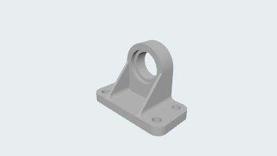</picture><br><strong>14. Bearing housing</strong></a><br>CAD<br><a href="https://github.com/parapoly-engine/parapoly-engine-showcase/releases/download/models-2026-09-22/14-bearing-housing-part3d.glb">GLB</a> · <a href="https://github.com/parapoly-engine/parapoly-engine-showcase/releases/download/models-2026-09-22/14-bearing-housing-part3d.step">STEP</a> · <a href="examples/14-bearing-housing-part3d/main.code3d.js">Code</a></td>
    <td width="25%" valign="top" align="center"><a href="examples/14-bearing-housing-part3d/README.md"><picture><source media="(prefers-color-scheme: dark)" srcset="examples/14-bearing-housing-part3d/bmax/64/preview.png">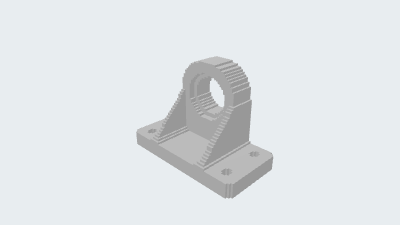</picture></a><br><strong>BMAX 64</strong><br>Longest edge 64 voxels<br>Voxel size ≈ 1.5625<br><a href="https://github.com/parapoly-engine/parapoly-engine-showcase/releases/download/models-2026-09-22/14-bearing-housing-part3d-bmax-64.bmax">Download BMAX 64</a></td>
    <td width="25%" valign="top" align="center"><a href="examples/14-bearing-housing-part3d/README.md"><picture><source media="(prefers-color-scheme: dark)" srcset="examples/14-bearing-housing-part3d/bmax/32/preview.png"></picture></a><br><strong>BMAX 32</strong><br>Longest edge 32 voxels<br>Voxel size ≈ 3.125<br><a href="https://github.com/parapoly-engine/parapoly-engine-showcase/releases/download/models-2026-09-22/14-bearing-housing-part3d-bmax-32.bmax">Download BMAX 32</a></td>
    <td width="25%" valign="top" align="center"><a href="examples/14-bearing-housing-part3d/README.md"><picture><source media="(prefers-color-scheme: dark)" srcset="examples/14-bearing-housing-part3d/bmax/16/preview.png">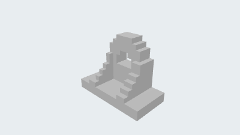</picture></a><br><strong>BMAX 16</strong><br>Longest edge 16 voxels<br>Voxel size ≈ 6.25<br><a href="https://github.com/parapoly-engine/parapoly-engine-showcase/releases/download/models-2026-09-22/14-bearing-housing-part3d-bmax-16.bmax">Download BMAX 16</a></td>
  </tr>
  <tr>
    <td width="25%" valign="top" align="center"><a href="examples/15-high-speed-shaft-part3d/README.md"><picture><source media="(prefers-color-scheme: dark)" srcset="examples/15-high-speed-shaft-part3d/preview.png">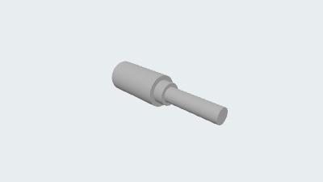</picture><br><strong>15. High-speed shaft</strong></a><br>CAD<br><a href="https://github.com/parapoly-engine/parapoly-engine-showcase/releases/download/models-2026-09-22/15-high-speed-shaft-part3d.glb">GLB</a> · <a href="https://github.com/parapoly-engine/parapoly-engine-showcase/releases/download/models-2026-09-22/15-high-speed-shaft-part3d.step">STEP</a> · <a href="examples/15-high-speed-shaft-part3d/main.code3d.js">Code</a></td>
    <td width="25%" valign="top" align="center"><a href="examples/15-high-speed-shaft-part3d/README.md"><picture><source media="(prefers-color-scheme: dark)" srcset="examples/15-high-speed-shaft-part3d/bmax/64/preview.png"></picture></a><br><strong>BMAX 64</strong><br>Longest edge 64 voxels<br>Voxel size ≈ 1.25<br><a href="https://github.com/parapoly-engine/parapoly-engine-showcase/releases/download/models-2026-09-22/15-high-speed-shaft-part3d-bmax-64.bmax">Download BMAX 64</a></td>
    <td width="25%" valign="top" align="center"><a href="examples/15-high-speed-shaft-part3d/README.md"><picture><source media="(prefers-color-scheme: dark)" srcset="examples/15-high-speed-shaft-part3d/bmax/32/preview.png">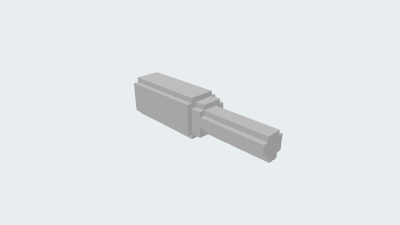</picture></a><br><strong>BMAX 32</strong><br>Longest edge 32 voxels<br>Voxel size ≈ 2.5<br><a href="https://github.com/parapoly-engine/parapoly-engine-showcase/releases/download/models-2026-09-22/15-high-speed-shaft-part3d-bmax-32.bmax">Download BMAX 32</a></td>
    <td width="25%" valign="top" align="center"><a href="examples/15-high-speed-shaft-part3d/README.md"><picture><source media="(prefers-color-scheme: dark)" srcset="examples/15-high-speed-shaft-part3d/bmax/16/preview.png"></picture></a><br><strong>BMAX 16</strong><br>Longest edge 16 voxels<br>Voxel size ≈ 5<br><a href="https://github.com/parapoly-engine/parapoly-engine-showcase/releases/download/models-2026-09-22/15-high-speed-shaft-part3d-bmax-16.bmax">Download BMAX 16</a></td>
  </tr>
  <tr>
    <td width="25%" valign="top" align="center"><a href="examples/16-housing-part3d/README.md"><picture><source media="(prefers-color-scheme: dark)" srcset="examples/16-housing-part3d/preview.png"></picture><br><strong>16. Mechanical housing</strong></a><br>CAD<br><a href="https://github.com/parapoly-engine/parapoly-engine-showcase/releases/download/models-2026-09-22/16-housing-part3d.glb">GLB</a> · <a href="https://github.com/parapoly-engine/parapoly-engine-showcase/releases/download/models-2026-09-22/16-housing-part3d.step">STEP</a> · <a href="examples/16-housing-part3d/main.code3d.js">Code</a></td>
    <td width="25%" valign="top" align="center"><a href="examples/16-housing-part3d/README.md"><picture><source media="(prefers-color-scheme: dark)" srcset="examples/16-housing-part3d/bmax/64/preview.png"></picture></a><br><strong>BMAX 64</strong><br>Longest edge 64 voxels<br>Voxel size ≈ 1.89844<br><a href="https://github.com/parapoly-engine/parapoly-engine-showcase/releases/download/models-2026-09-22/16-housing-part3d-bmax-64.bmax">Download BMAX 64</a></td>
    <td width="25%" valign="top" align="center"><a href="examples/16-housing-part3d/README.md"><picture><source media="(prefers-color-scheme: dark)" srcset="examples/16-housing-part3d/bmax/32/preview.png"></picture></a><br><strong>BMAX 32</strong><br>Longest edge 32 voxels<br>Voxel size ≈ 3.79688<br><a href="https://github.com/parapoly-engine/parapoly-engine-showcase/releases/download/models-2026-09-22/16-housing-part3d-bmax-32.bmax">Download BMAX 32</a></td>
    <td width="25%" valign="top" align="center"><a href="examples/16-housing-part3d/README.md"><picture><source media="(prefers-color-scheme: dark)" srcset="examples/16-housing-part3d/bmax/16/preview.png"></picture></a><br><strong>BMAX 16</strong><br>Longest edge 16 voxels<br>Voxel size ≈ 7.59375<br><a href="https://github.com/parapoly-engine/parapoly-engine-showcase/releases/download/models-2026-09-22/16-housing-part3d-bmax-16.bmax">Download BMAX 16</a></td>
  </tr>
  <tr>
    <td width="25%" valign="top" align="center"><a href="examples/17-stirling-d16-c/README.md"><picture><source media="(prefers-color-scheme: dark)" srcset="examples/17-stirling-d16-c/preview.png"></picture><br><strong>17. Low-temperature Stirling engine</strong></a><br>CAD<br><a href="https://github.com/parapoly-engine/parapoly-engine-showcase/releases/download/models-2026-09-22/17-stirling-d16-c.glb">GLB</a> · <a href="https://github.com/parapoly-engine/parapoly-engine-showcase/releases/download/models-2026-09-22/17-stirling-d16-c.step">STEP</a> · <a href="examples/17-stirling-d16-c/main.code3d.js">Code</a></td>
    <td width="25%" valign="top" align="center"><a href="examples/17-stirling-d16-c/README.md"><picture><source media="(prefers-color-scheme: dark)" srcset="examples/17-stirling-d16-c/bmax/64/preview.png"></picture></a><br><strong>BMAX 64</strong><br>Longest edge 64 voxels<br>Voxel size ≈ 2.1875<br><a href="https://github.com/parapoly-engine/parapoly-engine-showcase/releases/download/models-2026-09-22/17-stirling-d16-c-bmax-64.bmax">Download BMAX 64</a></td>
    <td width="25%" valign="top" align="center"><a href="examples/17-stirling-d16-c/README.md"><picture><source media="(prefers-color-scheme: dark)" srcset="examples/17-stirling-d16-c/bmax/32/preview.png"></picture></a><br><strong>BMAX 32</strong><br>Longest edge 32 voxels<br>Voxel size ≈ 4.375<br><a href="https://github.com/parapoly-engine/parapoly-engine-showcase/releases/download/models-2026-09-22/17-stirling-d16-c-bmax-32.bmax">Download BMAX 32</a></td>
    <td width="25%" valign="top" align="center"><a href="examples/17-stirling-d16-c/README.md"><picture><source media="(prefers-color-scheme: dark)" srcset="examples/17-stirling-d16-c/bmax/16/preview.png"></picture></a><br><strong>BMAX 16</strong><br>Longest edge 16 voxels<br>Voxel size ≈ 8.75<br><a href="https://github.com/parapoly-engine/parapoly-engine-showcase/releases/download/models-2026-09-22/17-stirling-d16-c-bmax-16.bmax">Download BMAX 16</a></td>
  </tr>
  <tr>
    <td width="25%" valign="top" align="center"><a href="examples/18-stirling-horizontal-quartz/README.md"><picture><source media="(prefers-color-scheme: dark)" srcset="examples/18-stirling-horizontal-quartz/preview.png"></picture><br><strong>18. Horizontal Stirling engine</strong></a><br>CAD<br><a href="https://github.com/parapoly-engine/parapoly-engine-showcase/releases/download/models-2026-09-22/18-stirling-horizontal-quartz.glb">GLB</a> · <a href="https://github.com/parapoly-engine/parapoly-engine-showcase/releases/download/models-2026-09-22/18-stirling-horizontal-quartz.step">STEP</a> · <a href="examples/18-stirling-horizontal-quartz/main.code3d.js">Code</a></td>
    <td width="25%" valign="top" align="center"><a href="examples/18-stirling-horizontal-quartz/README.md"><picture><source media="(prefers-color-scheme: dark)" srcset="examples/18-stirling-horizontal-quartz/bmax/64/preview.png"></picture></a><br><strong>BMAX 64</strong><br>Longest edge 64 voxels<br>Voxel size ≈ 3.125<br><a href="https://github.com/parapoly-engine/parapoly-engine-showcase/releases/download/models-2026-09-22/18-stirling-horizontal-quartz-bmax-64.bmax">Download BMAX 64</a></td>
    <td width="25%" valign="top" align="center"><a href="examples/18-stirling-horizontal-quartz/README.md"><picture><source media="(prefers-color-scheme: dark)" srcset="examples/18-stirling-horizontal-quartz/bmax/32/preview.png"></picture></a><br><strong>BMAX 32</strong><br>Longest edge 32 voxels<br>Voxel size ≈ 6.25<br><a href="https://github.com/parapoly-engine/parapoly-engine-showcase/releases/download/models-2026-09-22/18-stirling-horizontal-quartz-bmax-32.bmax">Download BMAX 32</a></td>
    <td width="25%" valign="top" align="center"><a href="examples/18-stirling-horizontal-quartz/README.md"><picture><source media="(prefers-color-scheme: dark)" srcset="examples/18-stirling-horizontal-quartz/bmax/16/preview.png"></picture></a><br><strong>BMAX 16</strong><br>Longest edge 16 voxels<br>Voxel size ≈ 12.5<br><a href="https://github.com/parapoly-engine/parapoly-engine-showcase/releases/download/models-2026-09-22/18-stirling-horizontal-quartz-bmax-16.bmax">Download BMAX 16</a></td>
  </tr>
  <tr>
    <td width="25%" valign="top" align="center"><a href="examples/19-ge-e3-fan-module/README.md"><picture><source media="(prefers-color-scheme: dark)" srcset="examples/19-ge-e3-fan-module/preview.png"></picture><br><strong>19. GE E³ fan module</strong></a><br>CAD<br><a href="https://github.com/parapoly-engine/parapoly-engine-showcase/releases/download/models-2026-09-22/19-ge-e3-fan-module.glb">GLB</a> · <a href="https://github.com/parapoly-engine/parapoly-engine-showcase/releases/download/models-2026-09-22/19-ge-e3-fan-module.step">STEP</a> · <a href="examples/19-ge-e3-fan-module/main.code3d.js">Code</a></td>
    <td width="25%" valign="top" align="center"><a href="examples/19-ge-e3-fan-module/README.md"><picture><source media="(prefers-color-scheme: dark)" srcset="examples/19-ge-e3-fan-module/bmax/64/preview.png"></picture></a><br><strong>BMAX 64</strong><br>Longest edge 64 voxels<br>Voxel size ≈ 3.46775<br><a href="https://github.com/parapoly-engine/parapoly-engine-showcase/releases/download/models-2026-09-22/19-ge-e3-fan-module-bmax-64.bmax">Download BMAX 64</a></td>
    <td width="25%" valign="top" align="center"><a href="examples/19-ge-e3-fan-module/README.md"><picture><source media="(prefers-color-scheme: dark)" srcset="examples/19-ge-e3-fan-module/bmax/32/preview.png"></picture></a><br><strong>BMAX 32</strong><br>Longest edge 32 voxels<br>Voxel size ≈ 6.93551<br><a href="https://github.com/parapoly-engine/parapoly-engine-showcase/releases/download/models-2026-09-22/19-ge-e3-fan-module-bmax-32.bmax">Download BMAX 32</a></td>
    <td width="25%" valign="top" align="center"><a href="examples/19-ge-e3-fan-module/README.md"><picture><source media="(prefers-color-scheme: dark)" srcset="examples/19-ge-e3-fan-module/bmax/16/preview.png"></picture></a><br><strong>BMAX 16</strong><br>Longest edge 16 voxels<br>Voxel size ≈ 13.871<br><a href="https://github.com/parapoly-engine/parapoly-engine-showcase/releases/download/models-2026-09-22/19-ge-e3-fan-module-bmax-16.bmax">Download BMAX 16</a></td>
  </tr>
  <tr>
    <td width="25%" valign="top" align="center"><a href="examples/20-cargo-atv/README.md"><picture><source media="(prefers-color-scheme: dark)" srcset="examples/20-cargo-atv/preview.png"></picture><br><strong>20. Cargo ATV</strong></a><br>CAD<br><a href="https://github.com/parapoly-engine/parapoly-engine-showcase/releases/download/models-2026-09-22/20-cargo-atv.glb">GLB</a> · <a href="https://github.com/parapoly-engine/parapoly-engine-showcase/releases/download/models-2026-09-22/20-cargo-atv.step">STEP</a> · <a href="examples/20-cargo-atv/main.code3d.js">Code</a></td>
    <td width="25%" valign="top" align="center"><a href="examples/20-cargo-atv/README.md"><picture><source media="(prefers-color-scheme: dark)" srcset="examples/20-cargo-atv/bmax/64/preview.png"></picture></a><br><strong>BMAX 64</strong><br>Longest edge 64 voxels<br>Voxel size ≈ 3.41664<br><a href="https://github.com/parapoly-engine/parapoly-engine-showcase/releases/download/models-2026-09-22/20-cargo-atv-bmax-64.bmax">Download BMAX 64</a></td>
    <td width="25%" valign="top" align="center"><a href="examples/20-cargo-atv/README.md"><picture><source media="(prefers-color-scheme: dark)" srcset="examples/20-cargo-atv/bmax/32/preview.png"></picture></a><br><strong>BMAX 32</strong><br>Longest edge 32 voxels<br>Voxel size ≈ 6.83328<br><a href="https://github.com/parapoly-engine/parapoly-engine-showcase/releases/download/models-2026-09-22/20-cargo-atv-bmax-32.bmax">Download BMAX 32</a></td>
    <td width="25%" valign="top" align="center"><a href="examples/20-cargo-atv/README.md"><picture><source media="(prefers-color-scheme: dark)" srcset="examples/20-cargo-atv/bmax/16/preview.png"></picture></a><br><strong>BMAX 16</strong><br>Longest edge 16 voxels<br>Voxel size ≈ 13.6666<br><a href="https://github.com/parapoly-engine/parapoly-engine-showcase/releases/download/models-2026-09-22/20-cargo-atv-bmax-16.bmax">Download BMAX 16</a></td>
  </tr>
  <tr>
    <td width="25%" valign="top" align="center"><a href="examples/21-baltsar-chair/README.md"><picture><source media="(prefers-color-scheme: dark)" srcset="examples/21-baltsar-chair/preview.png"></picture><br><strong>21. BALTSAR chair</strong></a><br>CAD<br><a href="https://github.com/parapoly-engine/parapoly-engine-showcase/releases/download/models-2026-09-22/21-baltsar-chair.glb">GLB</a> · <a href="https://github.com/parapoly-engine/parapoly-engine-showcase/releases/download/models-2026-09-22/21-baltsar-chair.step">STEP</a> · <a href="examples/21-baltsar-chair/main.code3d.js">Code</a></td>
    <td width="25%" valign="top" align="center"><a href="examples/21-baltsar-chair/README.md"><picture><source media="(prefers-color-scheme: dark)" srcset="examples/21-baltsar-chair/bmax/64/preview.png"></picture></a><br><strong>BMAX 64</strong><br>Longest edge 64 voxels<br>Voxel size ≈ 13.2819<br><a href="https://github.com/parapoly-engine/parapoly-engine-showcase/releases/download/models-2026-09-22/21-baltsar-chair-bmax-64.bmax">Download BMAX 64</a></td>
    <td width="25%" valign="top" align="center"><a href="examples/21-baltsar-chair/README.md"><picture><source media="(prefers-color-scheme: dark)" srcset="examples/21-baltsar-chair/bmax/32/preview.png"></picture></a><br><strong>BMAX 32</strong><br>Longest edge 32 voxels<br>Voxel size ≈ 26.5638<br><a href="https://github.com/parapoly-engine/parapoly-engine-showcase/releases/download/models-2026-09-22/21-baltsar-chair-bmax-32.bmax">Download BMAX 32</a></td>
    <td width="25%" valign="top" align="center"><a href="examples/21-baltsar-chair/README.md"><picture><source media="(prefers-color-scheme: dark)" srcset="examples/21-baltsar-chair/bmax/16/preview.png"></picture></a><br><strong>BMAX 16</strong><br>Longest edge 16 voxels<br>Voxel size ≈ 53.1277<br><a href="https://github.com/parapoly-engine/parapoly-engine-showcase/releases/download/models-2026-09-22/21-baltsar-chair-bmax-16.bmax">Download BMAX 16</a></td>
  </tr>
</table>

## Start designing with AI

Install [Node.js](https://nodejs.org/) 18 or newer. The native npm package supports Windows x64 and Linux x64 (glibc 2.35+). In a new project folder, run:

```sh
npx -y parapoly-engine init
```

This prepares the project and AI assistant instructions. Then try a prompt such as:

> Use parapoly-engine code3d to design a chair with a curved backrest and four tapered legs. Keep the model in one main.code3d.js file and export GLB and STEP.

You can also ask your assistant to modify an example: change its dimensions, shape, colors or assembly parameters. For examples with a `skills/` folder, ask the assistant to read those design lessons first. The model sources and some design notes retain their original Chinese comments.

## Use an example

Download **GLB** to view the colored 3D model, **STEP** to open the solid geometry in compatible CAD software, or **BMAX** for a static colored voxel model in Paracraft. BMAX represents the model as blocks and does not retain exact CAD surfaces or transparency. You do not need to install the engine to use these prepared files. Use the versioned Release download links above; the download sizes are listed on each example page.

Clone the source and previews; download models separately from the versioned Release links above:

```sh
git clone https://github.com/parapoly-engine/parapoly-engine-showcase.git
cd parapoly-engine-showcase
```

Model downloads are Release assets and are not included in the current checkout. Historical tags may still use Git LFS.

To edit and export a small example from the repository root:

```sh
npm install parapoly-engine
npx --no-install parapoly-engine setup-ai
npx --no-install parapoly-engine export examples/1-boolean-cutout/main.code3d.js -f glb,step -o generated/1-boolean-cutout
```

Replace the source path with another example. Exports go to `generated/`, keeping the supplied model downloads intact. Complex assemblies may take longer; see their source parameters and the npm package documentation.

The source examples can use APIs newer than the currently published package. In particular, rebuilding the transparent BALTSAR chair requires `set_opacity()` support; the prepared downloads remain usable independently. See its example page for details.

## What's in each example?

- `main.code3d.js` — editable model source.
- `preview.png` and `preview-light.png` — two background themes.
- `dist/models/` — GLB, STEP and BMAX downloads.
- `multiview/` — available orthographic, detail and comparison images.
- `skills/` — available modeling lessons for AI assistants and model authors.

Models are design and learning examples. Product-inspired models are studies, not manufacturer drawings; mechanical demonstrations are not certified working machines. Dimensions and assumptions belong to each model, so do not assume every example uses the same scale or units.

[MIT license](LICENSE). Product and organization names identify the references being studied and do not imply endorsement.
