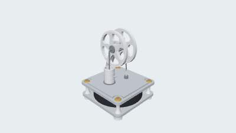
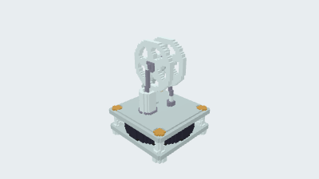
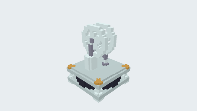
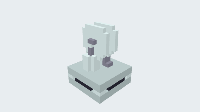

# Low-temperature Stirling engine

[简体中文](README.zh-CN.md) · [All examples](../../README.md)

A display assembly with twin flywheels, a power piston and a displacer.

<table>
  <tr>
    <td width="25%" valign="top" align="center"><a href="README.md"><picture><source media="(prefers-color-scheme: dark)" srcset="preview.png"></picture><br><strong>17. Low-temperature Stirling engine</strong></a><br>CAD<br><a href="https://github.com/parapoly-engine/parapoly-engine-showcase/releases/download/models-2026-09-22/17-stirling-d16-c.glb">GLB</a> · <a href="https://github.com/parapoly-engine/parapoly-engine-showcase/releases/download/models-2026-09-22/17-stirling-d16-c.step">STEP</a> · <a href="main.code3d.js">Code</a></td>
    <td width="25%" valign="top" align="center"><a href="README.md"><picture><source media="(prefers-color-scheme: dark)" srcset="bmax/64/preview.png"></picture></a><br><strong>BMAX 64</strong><br>Longest edge 64 voxels<br>Voxel size ≈ 2.1875<br><a href="https://github.com/parapoly-engine/parapoly-engine-showcase/releases/download/models-2026-09-22/17-stirling-d16-c-bmax-64.bmax">Download BMAX 64</a></td>
    <td width="25%" valign="top" align="center"><a href="README.md"><picture><source media="(prefers-color-scheme: dark)" srcset="bmax/32/preview.png"></picture></a><br><strong>BMAX 32</strong><br>Longest edge 32 voxels<br>Voxel size ≈ 4.375<br><a href="https://github.com/parapoly-engine/parapoly-engine-showcase/releases/download/models-2026-09-22/17-stirling-d16-c-bmax-32.bmax">Download BMAX 32</a></td>
    <td width="25%" valign="top" align="center"><a href="README.md"><picture><source media="(prefers-color-scheme: dark)" srcset="bmax/16/preview.png"></picture></a><br><strong>BMAX 16</strong><br>Longest edge 16 voxels<br>Voxel size ≈ 8.75<br><a href="https://github.com/parapoly-engine/parapoly-engine-showcase/releases/download/models-2026-09-22/17-stirling-d16-c-bmax-16.bmax">Download BMAX 16</a></td>
  </tr>
</table>

Designed with [parapoly-engine](https://www.npmjs.com/package/parapoly-engine).

## Downloads and source

| File / 文件 | Size / 大小 |
| --- | --- |
| [GLB](https://github.com/parapoly-engine/parapoly-engine-showcase/releases/download/models-2026-09-22/17-stirling-d16-c.glb) | 4.14 MiB |
| [STEP](https://github.com/parapoly-engine/parapoly-engine-showcase/releases/download/models-2026-09-22/17-stirling-d16-c.step) | 11.11 MiB |
| [BMAX 64](https://github.com/parapoly-engine/parapoly-engine-showcase/releases/download/models-2026-09-22/17-stirling-d16-c-bmax-64.bmax) | 0.42 MiB |
| [BMAX 32](https://github.com/parapoly-engine/parapoly-engine-showcase/releases/download/models-2026-09-22/17-stirling-d16-c-bmax-32.bmax) | 0.09 MiB |
| [BMAX 16](https://github.com/parapoly-engine/parapoly-engine-showcase/releases/download/models-2026-09-22/17-stirling-d16-c-bmax-16.bmax) | 0.02 MiB |

[main.code3d.js](main.code3d.js) · [Model information](model-info.json)

Use GLB for 3D viewing, STEP for CAD, and BMAX for static colored voxel models in Paracraft. BMAX does not retain exact surfaces or transparency. Download models on demand from versioned Release assets; cloning does not download them.

After installing the npm package, run from the repository root:

```sh
npx --no-install parapoly-engine export examples/17-stirling-d16-c/main.code3d.js -f glb,step -o generated/17-stirling-d16-c
```
