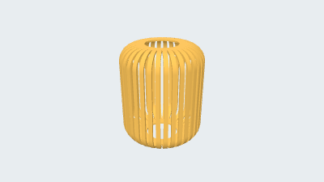

# Woven basket

[简体中文](README.zh-CN.md) · [All examples](../../README.md)

Repeated curved strips form an open woven container.

<picture><source media="(prefers-color-scheme: dark)" srcset="preview.png"></picture>

Designed with [parapoly-engine](https://www.npmjs.com/package/parapoly-engine).

## Downloads and source

| File / 文件 | Size / 大小 |
| --- | --- |
| [GLB](dist/models/main.glb) | 1.63 MiB |
| [STEP](dist/models/main.step) | 3.95 MiB |

[main.code3d.js](main.code3d.js) · [Model information](model-info.json)

Use GLB for 3D viewing and STEP for CAD. Open a file and use GitHub’s Download raw file; use Git LFS when cloning.

After installing the npm package, run from the repository root:

```sh
npx --no-install parapoly-engine export examples/2-woven-basket-block3d/main.code3d.js -f glb,step -o generated/2-woven-basket-block3d
```
