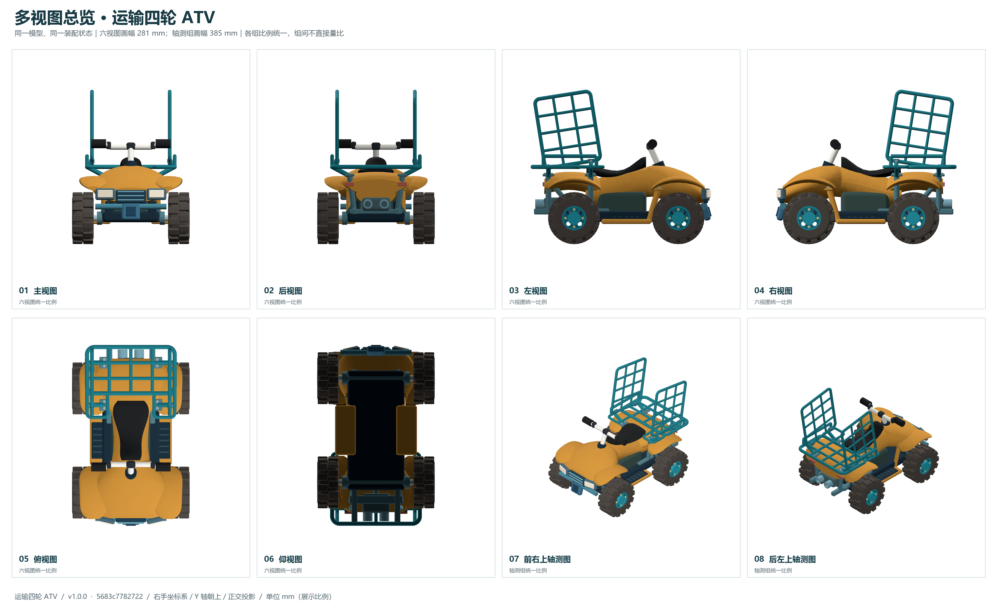

# 运输四轮 ATV

[English](README.md) · [全部示例](../../README.zh-CN.md)

带曲面车壳、后货台和管式护栏的运输四轮 ATV。

<picture><source media="(prefers-color-scheme: dark)" srcset="preview.png"></picture>

使用 [parapoly-engine](https://www.npmjs.com/package/parapoly-engine) 设计。

## 下载与源码

| File / 文件 | Size / 大小 |
| --- | --- |
| [GLB](dist/models/main.glb) | 27.40 MiB |
| [STEP](dist/models/main.step) | 18.31 MiB |

[main.code3d.js](main.code3d.js) · [模型资料](model-info.json)

GLB 用于三维查看，STEP 用于 CAD。点击文件后用 GitHub 的 Download raw file 获取；完整克隆请使用 Git LFS。

在仓库根目录安装 npm 包后，可运行：

```sh
npx --no-install parapoly-engine export examples/20-cargo-atv/main.code3d.js -f glb,step -o generated/20-cargo-atv
```

## 多视图

[全部视图与局部图](multiview/README.md)


