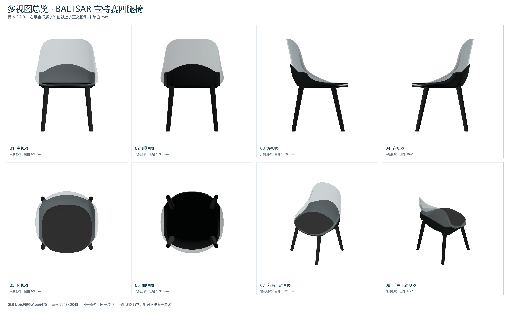

# BALTSAR chair

[简体中文](README.zh-CN.md) · [All examples](../../README.md)

A continuous transparent shell, upholstered seat and black four-leg support.

<table>
  <tr>
    <td width="25%" valign="top" align="center"><a href="README.md"><picture><source media="(prefers-color-scheme: dark)" srcset="preview.png"></picture><br><strong>21. BALTSAR chair</strong></a><br>CAD<br><a href="dist/models/21-baltsar-chair.glb">GLB</a> · <a href="dist/models/21-baltsar-chair.step">STEP</a> · <a href="main.code3d.js">Code</a></td>
    <td width="25%" valign="top" align="center"><a href="README.md"><picture><source media="(prefers-color-scheme: dark)" srcset="bmax/64/preview.png"></picture></a><br><strong>BMAX 64</strong><br>Longest edge 64 voxels<br>Voxel size ≈ 13.2819<br><a href="dist/models/bmax/64/main.bmax">Download BMAX 64</a></td>
    <td width="25%" valign="top" align="center"><a href="README.md"><picture><source media="(prefers-color-scheme: dark)" srcset="bmax/32/preview.png"></picture></a><br><strong>BMAX 32</strong><br>Longest edge 32 voxels<br>Voxel size ≈ 26.5638<br><a href="dist/models/bmax/32/main.bmax">Download BMAX 32</a></td>
    <td width="25%" valign="top" align="center"><a href="README.md"><picture><source media="(prefers-color-scheme: dark)" srcset="bmax/16/preview.png"></picture></a><br><strong>BMAX 16</strong><br>Longest edge 16 voxels<br>Voxel size ≈ 53.1277<br><a href="dist/models/bmax/16/main.bmax">Download BMAX 16</a></td>
  </tr>
</table>

Designed with [parapoly-engine](https://www.npmjs.com/package/parapoly-engine).

## Downloads and source

| File / 文件 | Size / 大小 |
| --- | --- |
| [GLB](dist/models/21-baltsar-chair.glb) | 9.31 MiB |
| [STEP](dist/models/21-baltsar-chair.step) | 1.22 MiB |
| [BMAX 64](dist/models/bmax/64/main.bmax) | 0.19 MiB |
| [BMAX 32](dist/models/bmax/32/main.bmax) | 0.03 MiB |
| [BMAX 16](dist/models/bmax/16/main.bmax) | 0.01 MiB |

[main.code3d.js](main.code3d.js) · [Model information](model-info.json)

Use GLB for 3D viewing, STEP for CAD, and BMAX for static colored voxel models in Paracraft. BMAX does not retain exact surfaces or transparency. Open a file and use GitHub’s Download raw file; use Git LFS when cloning.

After installing the npm package, run from the repository root:

```sh
npx --no-install parapoly-engine export examples/21-baltsar-chair/main.code3d.js -f glb,step -o generated/21-baltsar-chair
```

**Opacity API:** This source requires `set_opacity()`. As of 2026-09-21, the published npm 3.0.1 declarations do not include it; use a release with this API to rebuild the model. Prepared GLB/STEP files can be downloaded now. GLB uses alpha blending; STEP does not retain transparency.

## Multiple views

[All views and details](multiview/README.md)



## Design skills

Ask your AI assistant to read these skills before modifying a similar model. The design lessons are in Chinese.

- [parapoly-curved-shell-modeling](skills/parapoly-curved-shell-modeling/SKILL.md)
- [parapoly-shell-chair-design](skills/parapoly-shell-chair-design/SKILL.md)

## Reference and scope

[Reference](https://www.ikea.cn/cn/zh/p/baltsar-bao-te-sai-yi-zi-hei-se-30532139/) — A photo-based study of IKEA BALTSAR. Curves, thickness and connections are approximations, not manufacturer CAD.
