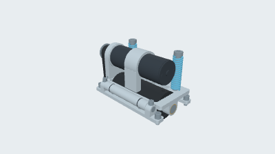
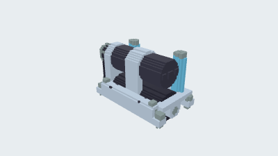
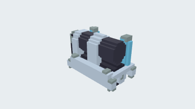
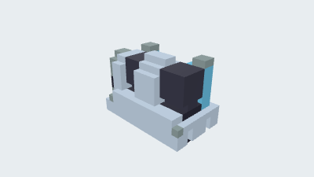

# Walking drive assembly

[简体中文](README.zh-CN.md) · [All examples](../../README.md)

A 61-part spring-loaded drive assembly with a 36ZY motor, timing-belt transmission, roller and pivoting support.

<table>
  <tr>
    <td width="25%" valign="top" align="center"><a href="README.md"><picture><source media="(prefers-color-scheme: dark)" srcset="preview.png"></picture><br><strong>22. Walking drive assembly</strong></a><br>CAD<br><a href="https://github.com/parapoly-engine/parapoly-engine-showcase/releases/download/models-2026-09-22-walking-drive/22-walking-drive-assembly.glb">GLB</a> · <a href="https://github.com/parapoly-engine/parapoly-engine-showcase/releases/download/models-2026-09-22-walking-drive/22-walking-drive-assembly.step">STEP</a> · <a href="main.code3d.js">Code</a></td>
    <td width="25%" valign="top" align="center"><a href="README.md"><picture><source media="(prefers-color-scheme: dark)" srcset="bmax/64/preview.png"></picture></a><br><strong>BMAX 64</strong><br>Longest edge 64 voxels<br>Voxel size ≈ 2.39063<br><a href="https://github.com/parapoly-engine/parapoly-engine-showcase/releases/download/models-2026-09-22-walking-drive/22-walking-drive-assembly-bmax-64.bmax">Download BMAX 64</a></td>
    <td width="25%" valign="top" align="center"><a href="README.md"><picture><source media="(prefers-color-scheme: dark)" srcset="bmax/32/preview.png"></picture></a><br><strong>BMAX 32</strong><br>Longest edge 32 voxels<br>Voxel size ≈ 4.78125<br><a href="https://github.com/parapoly-engine/parapoly-engine-showcase/releases/download/models-2026-09-22-walking-drive/22-walking-drive-assembly-bmax-32.bmax">Download BMAX 32</a></td>
    <td width="25%" valign="top" align="center"><a href="README.md"><picture><source media="(prefers-color-scheme: dark)" srcset="bmax/16/preview.png"></picture></a><br><strong>BMAX 16</strong><br>Longest edge 16 voxels<br>Voxel size ≈ 9.5625<br><a href="https://github.com/parapoly-engine/parapoly-engine-showcase/releases/download/models-2026-09-22-walking-drive/22-walking-drive-assembly-bmax-16.bmax">Download BMAX 16</a></td>
  </tr>
</table>

Designed with [parapoly-engine](https://www.npmjs.com/package/parapoly-engine).

## Downloads and source

| File / 文件 | Size / 大小 |
| --- | --- |
| [GLB](https://github.com/parapoly-engine/parapoly-engine-showcase/releases/download/models-2026-09-22-walking-drive/22-walking-drive-assembly.glb) | 4.56 MiB |
| [STEP](https://github.com/parapoly-engine/parapoly-engine-showcase/releases/download/models-2026-09-22-walking-drive/22-walking-drive-assembly.step) | 5.95 MiB |
| [BMAX 64](https://github.com/parapoly-engine/parapoly-engine-showcase/releases/download/models-2026-09-22-walking-drive/22-walking-drive-assembly-bmax-64.bmax) | 0.36 MiB |
| [BMAX 32](https://github.com/parapoly-engine/parapoly-engine-showcase/releases/download/models-2026-09-22-walking-drive/22-walking-drive-assembly-bmax-32.bmax) | 0.07 MiB |
| [BMAX 16](https://github.com/parapoly-engine/parapoly-engine-showcase/releases/download/models-2026-09-22-walking-drive/22-walking-drive-assembly-bmax-16.bmax) | 0.01 MiB |

[main.code3d.js](main.code3d.js) · [Model information](model-info.json)

Use GLB for 3D viewing, STEP for CAD, and BMAX for static colored voxel models in Paracraft. BMAX does not retain exact surfaces or transparency. Download models on demand from versioned Release assets; cloning does not download them.

After installing the npm package, run from the repository root:

```sh
npx --no-install parapoly-engine export examples/22-walking-drive-assembly/main.code3d.js -f glb,step -o generated/22-walking-drive-assembly
```

## Design skills

Ask your AI assistant to read these skills before modifying a similar model. The design lessons are in Chinese.

- [parapoly-walking-assembly-design](skills/parapoly-walking-assembly-design/SKILL.md)

## Reference and scope

[Reference](https://www.jlc-jdgf.com/machine-detail/622695255533043715) — Reconstructed from user-provided assembly and part STEP files, a bill of materials and a cover image for a JLC FA example. Threads, belt teeth and other details are simplified. This is a structural display model, not a manufacturing-ready design or a validated load or motion simulation.

<!-- voxel-downloads:start -->
## Voxel GLB downloads

Voxel surface meshes retain source base colors without BMAX RGB4 quantization. These GLB files use the same centering and display scale as standard BMAX loading. The existing BMAX thumbnails are not previews of these GLB files.

- [Voxel GLB 64](https://github.com/parapoly-engine/parapoly-engine-showcase/releases/download/voxel-models-2026-09-26/22-walking-drive-assembly-voxel-64.glb) (5.39 MiB)
- [Voxel GLB 32](https://github.com/parapoly-engine/parapoly-engine-showcase/releases/download/voxel-models-2026-09-26/22-walking-drive-assembly-voxel-32.glb) (1.08 MiB)
- [Voxel GLB 16](https://github.com/parapoly-engine/parapoly-engine-showcase/releases/download/voxel-models-2026-09-26/22-walking-drive-assembly-voxel-16.glb) (0.20 MiB)
<!-- voxel-downloads:end -->
