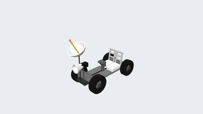
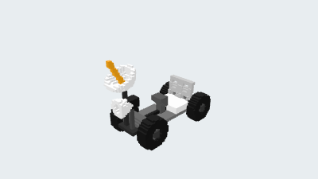
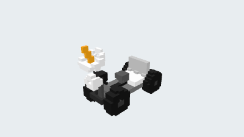
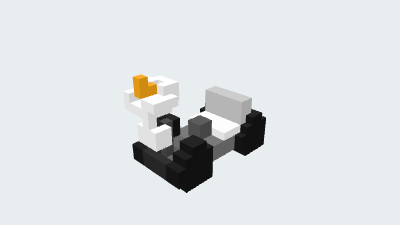

# 月球车

[English](README.md) · [全部示例](../../README.zh-CN.md)

由车身、轮组和科学仪器构成的月球车装配。

<table>
  <tr>
    <td width="25%" valign="top" align="center"><a href="README.zh-CN.md"><picture><source media="(prefers-color-scheme: dark)" srcset="preview.png"></picture><br><strong>7. 月球车</strong></a><br>CAD<br><a href="https://github.com/parapoly-engine/parapoly-engine-showcase/releases/download/models-2026-09-22/7-lunar-rover-block3d.glb">GLB</a> · <a href="https://github.com/parapoly-engine/parapoly-engine-showcase/releases/download/models-2026-09-22/7-lunar-rover-block3d.step">STEP</a> · <a href="main.code3d.js">源码</a></td>
    <td width="25%" valign="top" align="center"><a href="README.zh-CN.md"><picture><source media="(prefers-color-scheme: dark)" srcset="bmax/64/preview.png"></picture></a><br><strong>BMAX 64</strong><br>最长边 64 格<br>体素边长 ≈ 0.123005<br><a href="https://github.com/parapoly-engine/parapoly-engine-showcase/releases/download/models-2026-09-22/7-lunar-rover-block3d-bmax-64.bmax">下载 BMAX 64</a></td>
    <td width="25%" valign="top" align="center"><a href="README.zh-CN.md"><picture><source media="(prefers-color-scheme: dark)" srcset="bmax/32/preview.png"></picture></a><br><strong>BMAX 32</strong><br>最长边 32 格<br>体素边长 ≈ 0.246009<br><a href="https://github.com/parapoly-engine/parapoly-engine-showcase/releases/download/models-2026-09-22/7-lunar-rover-block3d-bmax-32.bmax">下载 BMAX 32</a></td>
    <td width="25%" valign="top" align="center"><a href="README.zh-CN.md"><picture><source media="(prefers-color-scheme: dark)" srcset="bmax/16/preview.png"></picture></a><br><strong>BMAX 16</strong><br>最长边 16 格<br>体素边长 ≈ 0.492018<br><a href="https://github.com/parapoly-engine/parapoly-engine-showcase/releases/download/models-2026-09-22/7-lunar-rover-block3d-bmax-16.bmax">下载 BMAX 16</a></td>
  </tr>
</table>

使用 [parapoly-engine](https://www.npmjs.com/package/parapoly-engine) 设计。

## 下载与源码

| File / 文件 | Size / 大小 |
| --- | --- |
| [GLB](https://github.com/parapoly-engine/parapoly-engine-showcase/releases/download/models-2026-09-22/7-lunar-rover-block3d.glb) | 1.67 MiB |
| [STEP](https://github.com/parapoly-engine/parapoly-engine-showcase/releases/download/models-2026-09-22/7-lunar-rover-block3d.step) | 0.93 MiB |
| [BMAX 64](https://github.com/parapoly-engine/parapoly-engine-showcase/releases/download/models-2026-09-22/7-lunar-rover-block3d-bmax-64.bmax) | 0.16 MiB |
| [BMAX 32](https://github.com/parapoly-engine/parapoly-engine-showcase/releases/download/models-2026-09-22/7-lunar-rover-block3d-bmax-32.bmax) | 0.03 MiB |
| [BMAX 16](https://github.com/parapoly-engine/parapoly-engine-showcase/releases/download/models-2026-09-22/7-lunar-rover-block3d-bmax-16.bmax) | 0.01 MiB |

[main.code3d.js](main.code3d.js) · [模型资料](model-info.json)

GLB 用于三维查看，STEP 用于 CAD，BMAX 用于 Paracraft 静态彩色体素模型。BMAX 不保留精确曲面或透明材质。模型从固定版本的 Release 附件按需下载，不随仓库克隆下载。

在仓库根目录安装 npm 包后，可运行：

```sh
npx --no-install parapoly-engine export examples/7-lunar-rover-block3d/main.code3d.js -f glb,step -o generated/7-lunar-rover-block3d
```
